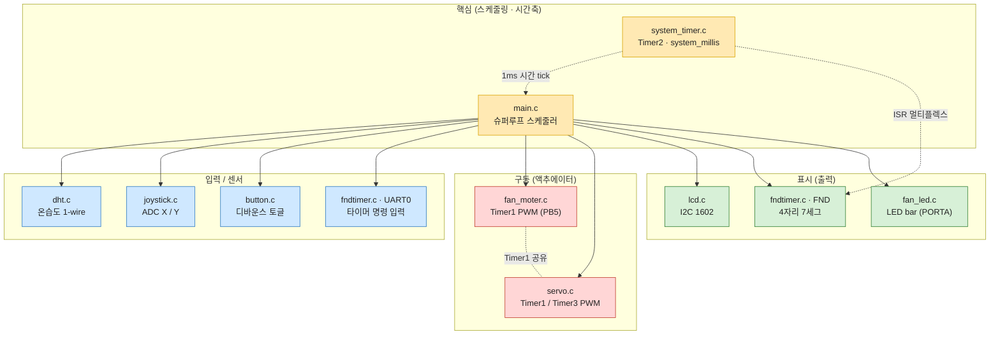
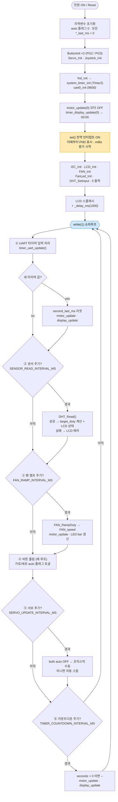
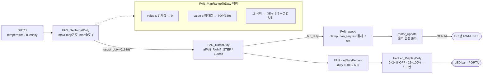
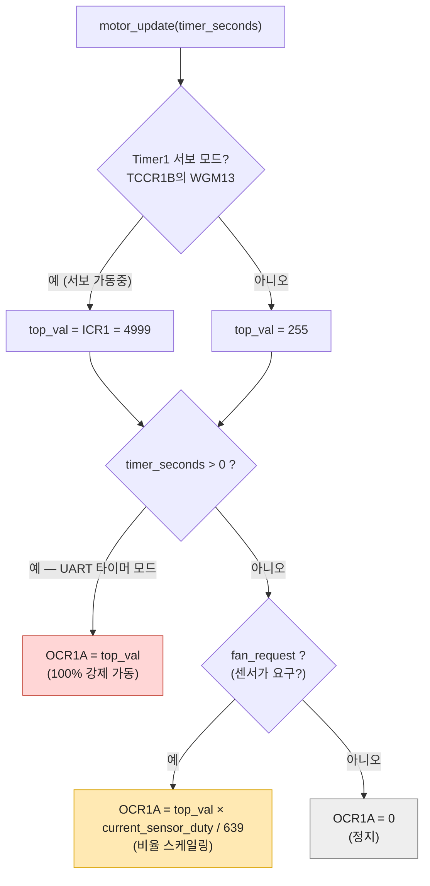
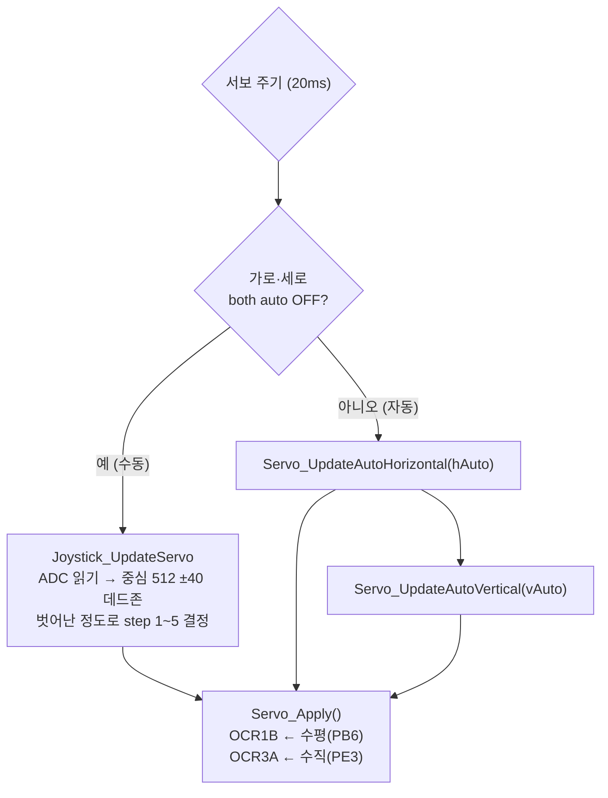
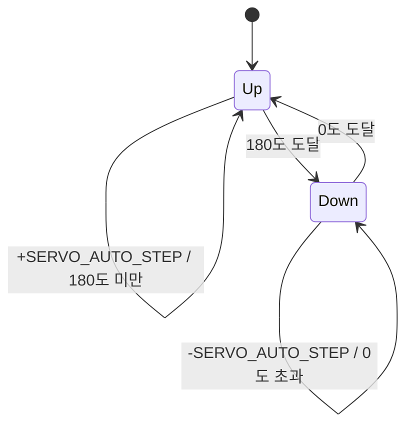
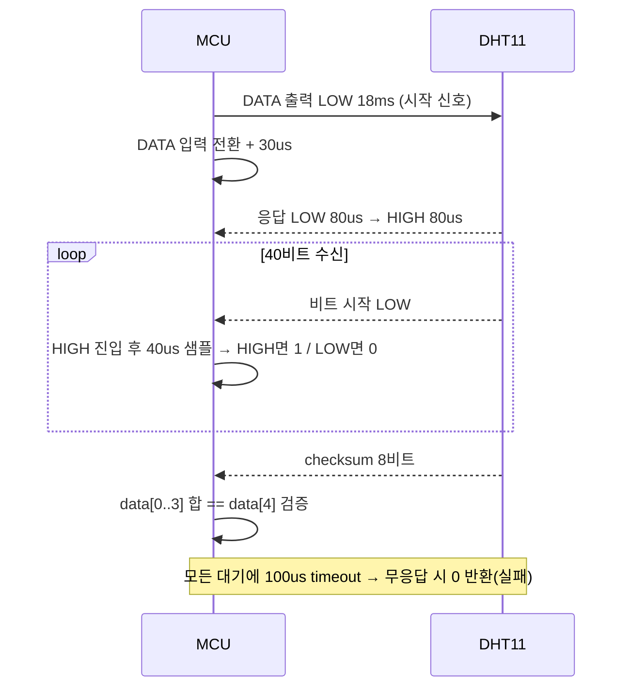

# 스마트 선풍기 펌웨어 — 시스템 플로우차트 & 설계 문서

> ATmega128A @ 16MHz · DHT11 온습도 연동 자동 선풍기
> 비선점형(cooperative) 슈퍼루프 스케줄러 기반 임베디드 제어 펌웨어

이 문서는 Obsidian Mermaid로 렌더링됩니다. (Settings → Core plugins → 미리보기에서 자동 표시)

---

## 목차
1. [프로젝트 개요](#1-프로젝트-개요)
2. [핵심 설계 포인트](#2-핵심-설계-포인트)
3. [하드웨어 · 타이머 자원 맵](#3-하드웨어--타이머-자원-맵)
4. [시스템 아키텍처](#4-시스템-아키텍처-모듈-맵)
5. [부팅 시퀀스 + 메인 슈퍼루프](#5-부팅-시퀀스--메인-슈퍼루프)
6. [스케줄러 태스크 표](#6-스케줄러-태스크-표)
7. [팬 듀티 제어 파이프라인](#7-팬-듀티-제어-파이프라인)
8. [motor_update 출력 우선순위 (Timer1 공유의 핵심)](#8-motor_update-출력-우선순위-timer1-공유의-핵심)
9. [서보 제어 — 수동 / 자동](#9-서보-제어--수동--자동)
10. [DHT11 읽기 시퀀스](#10-dht11-읽기-시퀀스)
11. [수정 가이드 — 어디를 어떻게 잡고 고치나](#11-수정-가이드--어디를-어떻게-잡고-고치나)

---

## 1. 프로젝트 개요

| 항목 | 내용 |
|------|------|
| MCU | ATmega128A, 16MHz |
| 구조 | 인터럽트 1개(Timer2) + 비선점형 슈퍼루프, RTOS 없음 |
| 입력 | DHT11(온습도), 조이스틱(ADC X/Y), 버튼 2개, UART 타이머 명령 |
| 출력 | DC 팬(PWM), 서보 2축(PWM), I2C LCD 1602, 4자리 FND, LED bar |
| 동작 요약 | 온습도로 팬 속도 자동 결정 → 부드럽게 램프 → LCD/LED에 표시. 조이스틱·버튼으로 서보(바람 방향) 수동/자동 제어. UART로 `MM:SS` 타이머 입력 시 그 시간 동안 팬 강제 가동 + FND 카운트다운. |

핵심 소스 맵:

| 파일 | 책임 |
|------|------|
| `main.c` | 초기화 + 슈퍼루프 스케줄러 (오케스트레이터) |
| `system_timer.c` | Timer2 기반 `system_millis` 시간축, 비차단 주기 판정 |
| `fndtimer.c` | 4FND 동적 표시(ISR), UART 입출력, 타이머 파싱/표시, 모터 출력 |
| `fan_moter.c` | 팬 목표 듀티 계산 · 램프 · PWM 출력(Timer1) |
| `servo.c` | 2축 서보 PWM(Timer1 CH-B / Timer3 CH-A), 자동 스윕 |
| `joystick.c` | ADC 읽기 → 서보 수동 제어 |
| `button.c` | 디바운스 + 엣지 검출 토글 |
| `dht.c` | DHT11 1-wire 비트뱅 프로토콜 |
| `lcd.c` | I2C(TWI) LCD 1602 드라이버 + 상태 표시 |
| `fan_led.c` | 팬 파워 → LED bar 8칸 표시 |
| `app_config.h` | **모든 튜닝 상수** (임계값/주기/스텝) — 단일 소스 |
| `pinmap.h` | **모든 핀/포트 매핑** — 단일 소스 |
| `led.c` | (레거시) `main.c`에서 미사용 |

---

## 2. 핵심 설계 포인트

포트폴리오에서 강조할 엔지니어링 포인트:

- **비차단 협조형 스케줄러** — `delay`로 흐름을 막지 않고 `system_millis_elapsed(&last, interval)` 패턴으로 6개 태스크를 서로 다른 주기로 돌린다. 한 태스크가 다른 태스크를 굶기지 않음.
- **단일 타이머 다중화** — Timer2 ISR 하나가 시간축(`system_millis`)과 4FND 동적 표시를 동시에 담당.
- **Timer1 자원 공유 + 자동 스케일링** — 팬 PWM(OCR1A)과 수평 서보(OCR1B)가 같은 Timer1을 공유. `motor_update`가 `WGM13` 비트로 서보 모드를 감지해 TOP(ICR1=4999)에 듀티를 비례 적용하는 "매직 스케일링" 구현.
- **팬 램프(soft-start)** — 목표 듀티로 한 번에 튀지 않고 100ms마다 ±16씩 수렴 → 기계적 충격·전류 스파이크 완화.
- **저주파 PWM 보정** — 서보와 Timer를 공유하면 50Hz로 느려져 1단계에서 팬이 덜덜거림. `FAN_MapRangeToDuty`에서 최소 45% 듀티 바닥을 깔아 관성 유지.
- **견고한 입력 처리** — 버튼 소프트웨어 디바운스, UART는 엔터/유휴 타임아웃 양쪽으로 파싱, DHT 통신은 모든 대기에 timeout을 둬 무한 루프 방지.
- **설정 중앙화** — 튜닝값은 `app_config.h`, 배선은 `pinmap.h` 한 곳에만. 코드 수정 없이 동작 조정 가능.

---

## 3. 하드웨어 · 타이머 자원 맵

| 자원 | 용도 | 모드 | 핀 |
|------|------|------|-----|
| **Timer0** | 미사용 | — | — |
| **Timer1** | 팬 PWM + 수평 서보 | Fast PWM, ICR1=4999 (50Hz) | OCR1A→PB5(팬), OCR1B→PB6(서보H) |
| **Timer2** | `system_millis` + FND 멀티플렉스 | CTC, 1ms 인터럽트 | — (ISR 내부) |
| **Timer3** | 수직 서보 | Fast PWM, ICR3=4999 (50Hz) | OCR3A→PE3 |
| **ADC** | 조이스틱 X/Y | 단일 변환 폴링 | ADC0(PF0), ADC1(PF1) |
| **TWI(I2C)** | LCD 1602 | 100kHz, 주소 `0x4E` | SDA/SCL |
| **USART0** | UART 타이머 입력 | 9600 8N1 (2x) | RXD0/TXD0 |
| **GPIO** | 버튼·FND·LED bar·DHT | 입/출력 | PG2/PG3(버튼), PORTC+PORTB(FND), PORTA(LED bar), PB0(DHT) |

---

## 4. 시스템 아키텍처 (모듈 맵)



---

## 5. 부팅 시퀀스 + 메인 슈퍼루프



---

## 6. 스케줄러 태스크 표

| # | 태스크 | 주기 상수 (`app_config.h`) | 설정값 | 동작 |
|---|--------|---------------------------|--------|------|
| ① | UART 타이머 | 매 루프 | — | `timer_uart_update()` 입력 파싱 → 새 값이면 모터/표시 갱신 |
| ② | 센서 읽기 | `SENSOR_READ_INTERVAL_MS` | 2000 | `DHT_Read` → 목표 듀티 계산, LCD 상태/에러 |
| ③ | 팬 램프 | `FAN_RAMP_INTERVAL_MS` | 100 | 현재 듀티를 목표로 ±16 수렴 → PWM, LED bar |
| ④ | 버튼 | 매 루프 | — | 가로/세로 자동 모드 토글 |
| ⑤ | 서보 | `SERVO_UPDATE_INTERVAL_MS` | 20 | 조이스틱 수동 또는 자동 스윕 |
| ⑥ | 카운트다운 | `TIMER_COUNTDOWN_INTERVAL_MS` | 1000 | 남은 초 감소 → 모터/FND 갱신 |

> ⚠️ **`system_millis` 주의 (수정 전 반드시 확인):** Timer2 ISR은 **1ms마다** 발생(`OCR2=249`, 64분주, 16MHz)하지만 `system_timer_tick(SYSTEM_TIMER_TICK_MS)`에서 매번 **4** 를 더한다. 즉 `system_millis`가 실제보다 약 **4배 빠르게** 증가하므로, 위 주기들은 라벨의 ms보다 **약 1/4 시간**에 발동한다 (예: 2000 → 실제 ≈ 500ms). 의도된 것이 아니라면 `SYSTEM_TIMER_TICK_MS`를 `1`로 바꿔라.

---

## 7. 팬 듀티 제어 파이프라인



매핑 임계값: 온도 `TEMP_THRESHOLD(28)`~`TEMP_MAX(30)`, 습도 `HUM_THRESHOLD(50)`~`HUM_MAX(90)`. 둘 중 더 큰 듀티를 채택.

---

## 8. motor_update 출력 우선순위 (Timer1 공유의 핵심)

`motor_update`는 팬 핀(OCR1A)에 실제로 쓰는 유일한 함수다. 서보가 Timer1을 점유했는지에 따라 스케일이 달라진다.



> **왜 이렇게?** `main.c`에서 `Servo_Init()`이 `FAN_init()`보다 먼저 실행되어 Timer1이 이미 50Hz·ICR1=4999 모드로 설정된다. `FAN_init`은 `if ((TCCR1B & 0x07) == 0)`로 "아직 아무도 Timer1을 안 켰을 때만" 8비트 기본 모드를 잡으므로, 실제로는 서보 설정을 **덮어쓰지 않는다.** 그래서 팬 논리 듀티(0~639)를 서보의 거대한 TOP(4999)에 비례 변환해야 한다.

---

## 9. 서보 제어 — 수동 / 자동



자동 모드의 스윕(왕복) 상태:



각도 보정값: `SERVO_0_DEG=125`, `SERVO_90_DEG=375`, `SERVO_180_DEG=625` (50Hz·ICR=4999 기준 카운트). 버튼은 각 축의 auto 플래그를 토글한다.

---

## 10. DHT11 읽기 시퀀스



성공 시 `humidity=data[0]`, `temperature=data[2]` (DHT11은 정수부만 사용). 이 함수는 약 20~25ms **블로킹**된다 (§11 주의 참고).

---

## 11. 수정 가이드 — 어디를 어떻게 잡고 고치나

### 11.1 기본 전략: "상수 → 함수 → 구조" 순으로 접근

대부분의 동작 변경은 **코드 흐름을 안 건드리고 상수만** 바꾸면 된다. 아래 순서로 좁혀 들어가라.

1. **동작 값만 바꾸고 싶다** → `app_config.h` (튜닝) / `pinmap.h` (배선) 만 수정.
2. **반응 곡선·로직을 바꾸고 싶다** → 해당 모듈의 계산 함수 하나만 수정.
3. **새 기능/주기를 추가하고 싶다** → 슈퍼루프에 태스크 블록 추가 (아래 패턴).

### 11.2 튜닝 상수 한눈에 (`app_config.h`)

| 바꾸고 싶은 것 | 상수 | 현재값 |
|----------------|------|--------|
| 팬 켜지는 온도 범위 | `TEMP_THRESHOLD` / `TEMP_MAX` | 28 / 30 |
| 팬 켜지는 습도 범위 | `HUM_THRESHOLD` / `HUM_MAX` | 50 / 90 |
| 팬 듀티 분해능(최대값) | `FAN_PWM_TOP` | 639 |
| LED bar 점등 시작 % | `FAN_START_DUTY_PERCENT` | 25 |
| 팬 가감속 부드러움 | `FAN_RAMP_STEP` (작을수록 느림) | 16 |
| 센서 읽기 주기 | `SENSOR_READ_INTERVAL_MS` | 2000 |
| 팬 갱신 주기 | `FAN_RAMP_INTERVAL_MS` | 100 |
| 서보 갱신 주기 | `SERVO_UPDATE_INTERVAL_MS` | 20 |
| 카운트다운 1초 | `TIMER_COUNTDOWN_INTERVAL_MS` | 1000 |
| 서보 각도 끝점 | `SERVO_0_DEG`/`_90_`/`_180_` | 125/375/625 |
| 자동 스윕 속도 | `SERVO_AUTO_STEP` | 1 |
| 조이스틱 민감도 | `JOYSTICK_DEAD_ZONE` / `SERVO_MAX_STEP` | 40 / 5 |
| 버튼 디바운스 | `BUTTON_DEBOUNCE_COUNT` (루프 횟수 단위) | 30 |
| UART 입력 길이/타임아웃 | `UART_INPUT_MAX` / `UART_INPUT_TIMEOUT` | 5 / 500 |

> ⚠️ 단, **팬 최소 45% 바닥값은 상수가 아니라** `fan_moter.c`의 `FAN_MapRangeToDuty` 안에 하드코딩(`* 45 / 100`)되어 있다. 저속을 더 낮추려면 이 줄을 직접 고쳐야 한다 — 리팩터링하려면 `app_config.h`로 빼내는 걸 추천.

### 11.3 자주 하는 수정 → 손대는 위치

| 하고 싶은 것 | 파일 / 함수 |
|--------------|-------------|
| 온습도→속도 반응 곡선 변경 | `fan_moter.c` · `FAN_MapRangeToDuty`, `FAN_GetTargetDuty` |
| 온도/습도 가중치(최댓값 대신 평균 등) | `fan_moter.c` · `FAN_GetTargetDuty` |
| LCD 표시 포맷/문구 | `lcd.c` · `LCD_PrintStatus`, `LCD_PrintDhtError` |
| LCD I2C 주소 | `lcd.c` · `#define LCD_ADDR` (0x27모듈=0x4E, 0x3F모듈=0x7E) |
| LED bar 점등 곡선 | `fan_led.c` · `FanLed_DisplayDuty` |
| 서보 자동 스윕 패턴 | `servo.c` · `Servo_UpdateAuto*` |
| 조이스틱 매핑 | `joystick.c` · `Joystick_UpdateServo` |
| UART 입력 포맷(MM:SS 외) | `fndtimer.c` · `timer_parse_input` |
| 핀 재배치 | `pinmap.h` (한 곳만) |

### 11.4 새 주기 태스크 추가 패턴

`main.c`에서 기존 태스크와 **완전히 동일한 패턴**으로 끼워 넣으면 된다:

```c
// 1) main() 상단 지역변수에 추가
uint32_t mytask_last_ms = 0;

// 2) app_config.h 에 주기 상수 추가
#define MYTASK_INTERVAL_MS 500

// 3) while(1) 안에 블록 추가 (비차단)
if (system_millis_elapsed(&mytask_last_ms, MYTASK_INTERVAL_MS)) {
    // ... 여기서 짧고 빠르게. 절대 _delay_ 쓰지 말 것 ...
}
```

### 11.5 반드시 알아야 할 주의 포인트 (gotcha)

- **`system_millis` 4배속** — §6 경고 참고. 새 주기 상수를 ms로 잡았는데 4배 빨리 도는 느낌이면 이것 때문. 시간축을 먼저 바로잡고(`SYSTEM_TIMER_TICK_MS=1`) 다른 주기를 튜닝하라.
- **Timer1은 팬 + 수평 서보 공유** — 팬이나 서보 한쪽에서 `TCCR1*`/`ICR1`을 독립적으로 재설정하면 다른 쪽이 깨진다. 초기화 순서(`Servo_Init` → `FAN_init`)와 `motor_update`의 `WGM13` 분기를 함께 보고 수정할 것.
- **`DHT_Read`는 ~20ms 블로킹** — 이 동안 슈퍼루프가 멈춘다(FND·millis는 ISR이라 영향 없음). 센서 주기를 너무 짧게 하면 서보/팬 반응이 끊긴다.
- **ISR 공유 변수는 ATOMIC** — `fnd_display_digits[]`, `system_millis`는 ISR과 메인이 같이 쓴다. 새로 건드릴 땐 `ATOMIC_BLOCK` 또는 `cli/sei`로 보호 (기존 `timer_display_update`, `system_millis_get` 참고).
- **버튼 디바운스는 시간이 아닌 "루프 횟수"** — `BUTTON_DEBOUNCE_COUNT(30)`는 ms가 아니라 폴링 호출 30회다. 루프 부하가 바뀌면 체감 디바운스 시간도 바뀐다.
- **`sei()` 이후에 표시가 시작** — 부팅 코드 순서를 바꿀 때 ISR 의존 초기화(FND 버퍼/모터)는 `sei()` 전에 끝나 있어야 한다.

### 11.6 작업 워크플로우

```bash
# 빌드 (CMake + AVR 툴체인)
cmake -S . -B build && cmake --build build
# 산출물: build/atmega128a.hex (+ .eep, 사이즈 출력)

# 코드 수정 후 지식 그래프 동기화 (CLAUDE.md 규칙, API 비용 없음)
graphify update .
```

### 11.7 이 문서로 길찾기 하는 법

1. **"무엇을 바꾸나" 결정** → §11.2 / §11.3 표에서 상수·함수 위치를 먼저 찾는다.
2. **"흐름 어디서 호출되나" 확인** → §5 슈퍼루프 차트에서 해당 태스크 번호(①~⑥)를 찾는다.
3. **"부작용 있나" 점검** → §3 자원 맵 + §8 Timer1 공유 + §11.5 주의 포인트를 교차 확인.
4. 크로스 모듈 관계가 헷갈리면 `graphify query "..."` / `graphify path "A" "B"`로 그래프를 직접 질의.

---

*문서 생성: 코드베이스 정적 분석 기반 (`main.c` + 13개 모듈 + `app_config.h`/`pinmap.h`).*
