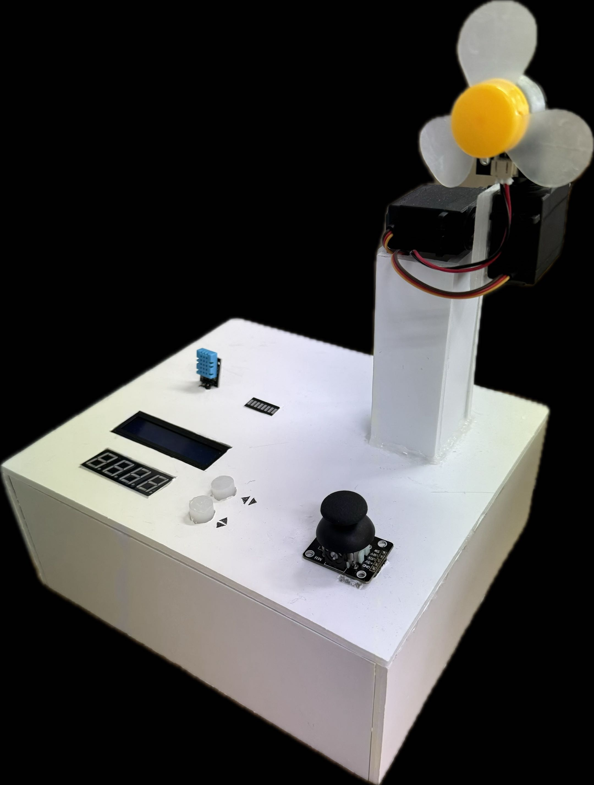

<div align="center">

# 💨 Smart Fan

### DHT 온습도 자동 제어 · 조이스틱 2축 방향 조절 · UART 타이머

<p>
  
  
  
  
</p>

<!-- TODO: assets/ 폴더에 아래 이미지를 추가한 뒤 주석을 해제하세요. -->
<p>
  
  &nbsp;&nbsp;
  <!--  -->
</p>

**온습도 센서로 팬 세기를 자동 조절하고, 조이스틱으로 바람 방향을 2축 제어하며, UART로 입력한 시간만큼 동작하는 ATmega128A 기반 스마트 선풍기입니다.**

<!-- TODO: 시연 영상 업로드 후 링크 추가
[▶ 동작 시연 영상](https://...)
-->

</div>

---

## 1. Project Overview

일반 선풍기의 "사람이 직접 세기와 방향을 맞춘다"는 조작 방식을 **환경 인식 기반 자동 제어**로 바꾸는 것을 목표로 했습니다.

DHT11 온습도 센서로 주변 환경을 2초마다 측정하여 팬 PWM 듀티를 자동으로 계산하고, 목표 듀티까지 단계적으로 램프업/다운시켜 급격한 속도 변화를 막았습니다. 방향 제어는 조이스틱 2축을 ADC로 읽어 수평·수직 서보를 독립 제어하며, 버튼으로 축별 자동 스윙 모드를 토글할 수 있습니다. 여기에 UART로 `MM:SS` 형식의 시간을 입력하면 4-digit FND에 카운트다운을 표시하면서 그동안 팬을 강제 가동하는 타이머 기능을 더했습니다.

MCU에 RTOS 없이, `Timer2` 기반 `system_millis` 시간축 하나로 **센서 읽기·팬 램프·서보 갱신·타이머 카운트다운을 서로 다른 주기로 논블로킹 병렬 실행**하도록 메인 루프를 구성한 것이 구조상 핵심입니다.

| 항목 | 내용 |
|---|---|
| 프로젝트 형태 | 팀 프로젝트 <!-- TODO: 팀 인원 수와 본인 담당 범위를 확정해 주세요 --> |
| 담당 범위 | <!-- TODO: 예) 팬 제어 로직, 조이스틱·서보 제어, 시스템 타이머 설계 --> |
| MCU | ATmega128A (16 MHz) |
| Language | C |
| Build System | CMake + avr-gcc (`tools/avr-gcc.cmake` 툴체인 파일) |
| 주요 인터페이스 | ADC, PWM (Timer1 / Timer3), TWI(I²C), USART, GPIO, 1-Wire 방식 DHT |
| RTOS | 미사용 — `system_millis` 기반 협조적 논블로킹 스케줄링 |

---

## 2. Key Features

| 기능 | 구현 내용 |
|---|---|
| **온습도 자동 팬 제어** | DHT11 값을 임계값 기준으로 PWM 듀티에 매핑하고 온도·습도 중 더 높은 요구치를 채택 |
| **Duty Ramping** | 목표 듀티까지 100 ms마다 16 스텝씩 증감시켜 급가속·급정지 억제 |
| **2축 서보 방향 제어** | 조이스틱 X → 수평 서보(Timer1 OC1B), Y → 수직 서보(Timer3 OC3A) 독립 제어 |
| **Auto Swing Mode** | 버튼 토글로 축별 자동 스윙(0°↔180° 왕복) 진입, 진입 시 조이스틱 입력 무시 |
| **UART Timer** | `MM:SS` 문자열을 파싱해 카운트다운, 남은 시간 동안 팬 100 % 강제 가동 |
| **4-Digit FND** | Timer2 ISR에서 4자리 동적 스캔(Dynamic Scan)으로 잔상 없이 `MMSS` 표시 |
| **I²C 1602 LCD** | 온도·습도·현재 듀티·목표 듀티를 2행으로 실시간 표시, 센서 실패 시 오류 화면 |
| **LED Power Bar** | 팬 듀티 %를 PORTA 8칸 LED 바에 누적 점등 패턴으로 시각화 |
| **Non-blocking Loop** | 센서 2000 ms / 램프 100 ms / 서보 20 ms / 카운트다운 1000 ms 를 단일 루프에서 병렬 처리 |
| **Software Debounce** | 버튼 상태 변화가 30회 연속 유지될 때만 Edge를 인정 |

---

## 3. Operating Modes

| Mode | 진입 조건 | 동작 |
|---|---|---|
| **Manual Direction** | 두 축 모두 Auto OFF (기본) | 조이스틱 X/Y로 수평·수직 서보를 직접 조작 |
| **Auto Swing (H)** | `PG2` 버튼 토글 | 수평 서보가 0°↔180° 자동 왕복 |
| **Auto Swing (V)** | `PG3` 버튼 토글 | 수직 서보가 0°↔180° 자동 왕복 |
| **Sensor Fan** | 상시 동작 | 온습도 기반으로 팬 듀티 자동 결정 |
| **Timer Fan** | UART로 `MM:SS` 입력 | 남은 시간 > 0 인 동안 팬을 100 %로 강제 가동 |

> 팬 세기(온습도/타이머)와 팬 방향(조이스틱/스윙)은 서로 독립적인 축이므로 동시에 동작합니다. 두 축 중 하나라도 Auto가 켜지면 조이스틱 입력은 무시됩니다.

---

## 4. System Architecture & Control Flow

<!-- TODO: assets/system_flow.png 추가 후 주석 해제
<p align="center">
  
</p>
-->

```text
┌──────────────┐   2000 ms   ┌──────────────────┐
│ DHT11 (PB0)  ├────────────►│ FAN_GetTargetDuty│──► target_duty
└──────────────┘             └──────────────────┘        │
                                                         │ 100 ms
┌──────────────┐             ┌──────────────────┐        ▼
│ UART0 9600bps├─ "MM:SS" ──►│ timer_parse_input│   FAN_RampDuty
└──────────────┘             └────────┬─────────┘        │
                                      │ timer_seconds    ▼
                                      ├──────────► motor_update ──► OCR1A (PB5, 팬)
                                      └──────────► timer_display_update
                                                           │
┌──────────────┐   20 ms   ┌──────────────┐                ▼
│ Joystick ADC ├──────────►│ Servo_Move*  │       ┌──────────────────┐
│ (PF0 / PF1)  │           └──────┬───────┘       │ Timer2 ISR (1 ms)│
└──────────────┘                  │               │  · system_millis │
┌──────────────┐   toggle         ▼               │  · 4FND 동적스캔 │
│ Button PG2/3 ├──────────► Servo_UpdateAuto*     └──────────────────┘
└──────────────┘                  │
                                  ▼
                          Servo_Apply() ──► OCR1B (PB6, 수평) / OCR3A (PE3, 수직)
```

### Control Flow

1. `Timer2` CTC 인터럽트(1 ms)가 `system_millis`를 누적하고 4-digit FND를 한 자리씩 순차 점등합니다.
2. 메인 루프는 `system_millis_elapsed()`로 각 작업의 주기 도래 여부만 검사하고, 도래하지 않은 작업은 즉시 건너뜁니다.
3. 2000 ms마다 DHT11을 읽어 `target_duty`를 재계산하고 LCD를 갱신합니다.
4. 100 ms마다 `fan_duty`를 `target_duty` 쪽으로 16씩 이동시키고, `motor_update()`가 타이머 상태와 합쳐 최종 `OCR1A`를 결정합니다.
5. 20 ms마다 조이스틱 또는 자동 스윙 로직이 서보 듀티를 갱신합니다.
6. 1000 ms마다 타이머를 1초 감소시키고 FND 표시 버퍼를 갱신합니다.

---

## 5. Temperature & Humidity Based Fan Control

### 5.1 Target Duty Mapping

온도와 습도를 각각 독립적으로 듀티에 매핑한 뒤, **더 강한 쪽을 채택**합니다.

```c
uint16_t FAN_GetTargetDuty(uint8_t temperature, uint8_t humidity)
{
    uint16_t temp_duty = FAN_MapRangeToDuty(temperature, TEMP_THRESHOLD, TEMP_MAX);
    uint16_t hum_duty  = FAN_MapRangeToDuty(humidity,    HUM_THRESHOLD,  HUM_MAX);

    return (temp_duty > hum_duty) ? temp_duty : hum_duty;
}
```

```c
// FAN_MapRangeToDuty() — 임계값 이하 정지, 최대값 이상 100%, 그 사이는 45%~100% 선형 매핑
if (value <= min_value) return 0;
if (value >= max_value) return FAN_PWM_TOP;

uint16_t min_pwm = (FAN_PWM_TOP * 45) / 100;
return min_pwm + (uint32_t)(value - min_value) * (FAN_PWM_TOP - min_pwm)
                 / (max_value - min_value);
```

| Parameter | Value | Description |
|---|---:|---|
| `TEMP_THRESHOLD` | 28 °C | 이 온도 이하에서는 팬 정지 |
| `TEMP_MAX` | 30 °C | 이 온도 이상에서 100 % 출력 |
| `HUM_THRESHOLD` | 50 %RH | 이 습도 이하에서는 팬 정지 |
| `HUM_MAX` | 90 %RH | 이 습도 이상에서 100 % 출력 |
| `FAN_PWM_TOP` | 639 | 듀티 계산의 논리적 최대값 (백분율 환산 기준) |
| 최소 구동 듀티 | 45 % | 50 Hz PWM에서 팬이 실제로 회전하기 시작하는 하한 |
| `FAN_RAMP_STEP` | 16 | 램프 1회당 듀티 변화량 |
| `FAN_RAMP_INTERVAL_MS` | 100 ms | 램프 갱신 주기 |
| `SENSOR_READ_INTERVAL_MS` | 2000 ms | DHT11 측정 주기 |

임계값 바로 위 구간에서 듀티가 0에 가깝게 계산되면 팬이 회전하지 못하고 진동만 하는 문제가 있어, **1단계 진입 시점의 듀티 하한을 45 %로 고정**했습니다. 팬과 서보가 Timer1을 공유하여 PWM 주파수가 50 Hz로 낮기 때문에 관성 유지에 필요한 최소 힘이 크기 때문입니다.

### 5.2 Duty Ramping

목표 듀티에 즉시 도달시키지 않고 100 ms마다 `FAN_RAMP_STEP`(16)씩만 이동시켜, 센서 값이 튈 때 팬이 급격히 요동치는 것을 막았습니다. 0 → 639까지는 약 40스텝이 필요합니다.

```c
uint16_t FAN_RampDuty(uint16_t current_duty, uint16_t target_duty)
{
    if (current_duty < target_duty) {
        uint16_t next_duty = current_duty + FAN_RAMP_STEP;
        return (next_duty > target_duty) ? target_duty : next_duty;
    }
    if (current_duty > target_duty) {
        if (current_duty < FAN_RAMP_STEP) return target_duty;
        uint16_t next_duty = current_duty - FAN_RAMP_STEP;
        return (next_duty < target_duty) ? target_duty : next_duty;
    }
    return current_duty;
}
```

### 5.3 Timer1 Shared PWM Scaling

수평 서보(`OC1B`, PB6)와 팬(`OC1A`, PB5)이 **동일한 Timer1**을 사용합니다. 서보 요구사항에 맞춰 Timer1은 `ICR1 = 4999` / 50 Hz Fast PWM으로 동작하므로, 팬 듀티도 8-bit(255)가 아니라 `ICR1` 기준으로 환산해야 합니다.

```c
void motor_update(uint16_t timer_seconds)
{
    uint32_t top_val = 255;
    if (TCCR1B & (1 << WGM13)) {          // 서보가 Timer1을 ICR1 TOP 모드로 바꿨는지 확인
        top_val = ICR1;
        if (top_val == 0) top_val = 255;
    }

    if (timer_seconds > 0) {
        OCR1A = top_val;                                                   // 타이머 동작 중 → 100 %
    } else if (motor_fan_request) {
        OCR1A = (uint16_t)((top_val * current_sensor_duty) / FAN_PWM_TOP); // 센서 비율 환산
    } else {
        OCR1A = 0;                                                         // 정지
    }
}
```

런타임에 `TCCR1B`의 `WGM13` 비트를 확인해 실제 TOP 값을 읽어오므로, 팬 모듈이 서보 초기화 순서에 의존하지 않습니다.

---

## 6. Joystick 2-Axis Servo Control

### 6.1 Deadzone + Proportional Step

```c
if (joystickX < (JOYSTICK_CENTER - JOYSTICK_DEAD_ZONE))
{
    step = 1 + ((JOYSTICK_CENTER - JOYSTICK_DEAD_ZONE - joystickX) / 120);
    if (step > SERVO_MAX_STEP) step = SERVO_MAX_STEP;
    Servo_MoveHorizontalUp(step);
}
```

| Parameter | Value | Description |
|---|---:|---|
| `JOYSTICK_CENTER` | 512 | 10-bit ADC 중앙값 |
| `JOYSTICK_DEAD_ZONE` | ±40 | 중앙 근처 노이즈로 인한 오동작 방지 구간 |
| `SERVO_MAX_STEP` | 5 | 1회 갱신당 최대 듀티 변화량 (급격한 튐 방지) |
| 비례 계수 | `/120` | 중앙에서 멀어질수록 step 증가 → 기울인 만큼 빠르게 이동 |
| `SERVO_UPDATE_INTERVAL_MS` | 20 ms | 서보 갱신 주기 |

조이스틱을 살짝 기울이면 `step = 1`, 끝까지 기울이면 `step = 5`가 되어 **가변 속도 조작감**을 만듭니다.

### 6.2 Servo PWM Configuration

두 서보는 서로 다른 타이머를 사용해 완전히 독립적으로 동작합니다.

| Servo | Timer | Output | Register | Mode |
|---|---|---|---|---|
| 수평 (Horizontal) | Timer1 | `OC1B` / PB6 | `OCR1B` | Fast PWM, `ICR1 = 4999`, 분주 64 → 50 Hz |
| 수직 (Vertical) | Timer3 | `OC3A` / PE3 | `OCR3A` | Fast PWM, `ICR3 = 4999`, 분주 64 → 50 Hz |

| Angle | Duty Value |
|---|---:|
| `SERVO_0_DEG` | 125 |
| `SERVO_90_DEG` | 375 (부팅 시 초기 위치) |
| `SERVO_180_DEG` | 625 |

모든 이동 함수(`Servo_MoveHorizontalUp/Down`, `Servo_MoveVerticalUp/Down`)는 내부에서 0°~180° 범위로 클램핑하여 서보 하드웨어 리밋을 넘지 않도록 보호합니다.

### 6.3 Auto Swing

```c
void Servo_UpdateAutoHorizontal(uint8_t isEnabled)
{
    static uint8_t direction = 1;
    if (!isEnabled) { Servo_Apply(); return; }

    if (direction) {
        Servo_MoveHorizontalUp(SERVO_AUTO_STEP);
        if (servoHorizontalDuty == SERVO_180_DEG) direction = 0;
    } else {
        Servo_MoveHorizontalDown(SERVO_AUTO_STEP);
        if (servoHorizontalDuty == SERVO_0_DEG) direction = 1;
    }
    Servo_Apply();
}
```

`SERVO_AUTO_STEP = 1`이므로 한 번 갱신될 때마다 듀티가 1씩 이동하며, 0°(125)에서 180°(625)까지 한 방향 스윙에 500 스텝이 필요합니다. 방향 반전 상태는 `static` 변수로 유지되어 축별로 독립적인 왕복 위상을 가집니다.

---

## 7. UART Timer & 4-Digit FND

### 7.1 Input Parsing

USART0(9600 bps, 8N1, 2배속 모드 `UBRR0L = 207`)로 `MM:SS` 또는 `MM` 형식의 문자열을 받습니다.

| 규칙 | 처리 |
|---|---|
| 숫자 / `:` | 입력 버퍼(`UART_INPUT_MAX = 5`)에 저장, 수신 문자를 그대로 에코 |
| `\r` / `\n` | 버퍼를 즉시 파싱하고 초기화 |
| 그 외 문자 | 잘못된 입력으로 보고 버퍼 폐기 |
| 분 범위 | 0 ~ 99, 최대 2자리 |
| 초 범위 | 0 ~ 59, 최대 2자리 |
| 엔터 없음 | `UART_INPUT_TIMEOUT`(500회) 동안 추가 입력이 없으면 자동 파싱 |

파싱에 성공하면 `timer_seconds = minutes * 60 + seconds`로 변환하고, 곧바로 `motor_update()`와 `timer_display_update()`를 호출해 팬 출력과 FND 표시를 동시에 반영합니다. 새 값 입력 직후에는 `second_last_ms`를 현재 시각으로 재설정하여 **입력 직후 1초가 즉시 깎이는 현상**을 막았습니다.

### 7.2 Dynamic Scan Display

4자리 FND를 Timer2 ISR 안에서 한 자리씩 순환 점등합니다.

```c
ISR(TIMER2_COMP_vect)
{
    uint8_t digit_port_keep = FND_DIGIT_PORT & ~FND_DIGIT_MASK;

    system_timer_tick(SYSTEM_TIMER_TICK_MS);

    FND_DIGIT_PORT = digit_port_keep | FND_DIGIT_MASK;                             // 전 자리 소등 (잔상 제거)
    FND_SEG_PORT   = fndNumber[fnd_display_digits[fnd_scan_digit]];                // 세그먼트 패턴 출력
    FND_DIGIT_PORT = digit_port_keep | (fnd_sel[fnd_scan_digit] & FND_DIGIT_MASK); // 해당 자리만 점등

    fnd_scan_digit++;
    if (fnd_scan_digit >= 4) fnd_scan_digit = 0;
}
```

- 자리 선택 비트만 마스킹하고 나머지 포트 비트는 보존하여, 같은 PORTB를 쓰는 팬 PWM(PB5)·서보(PB6)·DHT(PB0) 핀을 건드리지 않습니다.
- 세그먼트 패턴을 바꾸기 **전에** 모든 자리를 끄는 순서를 지켜 잔상(ghosting)을 제거했습니다.
- 표시 버퍼는 `ATOMIC_BLOCK`으로 갱신하여 ISR과의 경합을 차단했습니다.

---

## 8. Non-blocking Scheduling

RTOS 없이 단일 `while(1)` 루프에서 4개의 서로 다른 주기 작업을 병렬 실행합니다.

```c
uint8_t system_millis_elapsed(uint32_t *last_ms, uint16_t interval_ms)
{
    uint32_t now = system_millis_get();

    if ((uint32_t)(now - *last_ms) >= interval_ms) {
        *last_ms = now;
        return 1;
    }
    return 0;
}
```

| 작업 | 주기 상수 | 값 |
|---|---|---:|
| DHT 측정 + LCD 갱신 | `SENSOR_READ_INTERVAL_MS` | 2000 ms |
| 팬 듀티 램프 + LED 바 | `FAN_RAMP_INTERVAL_MS` | 100 ms |
| 서보 갱신 (조이스틱/스윙) | `SERVO_UPDATE_INTERVAL_MS` | 20 ms |
| 타이머 카운트다운 | `TIMER_COUNTDOWN_INTERVAL_MS` | 1000 ms |

- 뺄셈을 `uint32_t`로 수행하여 `system_millis` 오버플로 시에도 경과 시간 계산이 깨지지 않습니다.
- `system_millis` 읽기는 `ATOMIC_BLOCK`으로 보호하여 32-bit 변수의 부분 갱신(torn read)을 방지했습니다.
- 버튼 검사만 매 루프마다 수행하여 입력 반응성을 유지했습니다.

---

## 9. Hardware and Peripheral Mapping

| Peripheral | Pin / Port | Usage |
|---|---|---|
| ATmega128A | — | 16 MHz, 시스템 전체 제어 |
| DHT11 | `PB0` | 온습도 측정 (1-Wire 방식, 40-bit + checksum) |
| Fan Motor PWM | `PB5` (`OC1A`) | Timer1 Fast PWM, `ICR1 = 4999` 기준 듀티 |
| Servo Horizontal | `PB6` (`OC1B`) | Timer1 Fast PWM 50 Hz |
| Servo Vertical | `PE3` (`OC3A`) | Timer3 Fast PWM 50 Hz |
| Joystick X | `PF0` (`ADC0`) | 10-bit ADC, AVCC 기준, 분주 128 |
| Joystick Y | `PF1` (`ADC1`) | 10-bit ADC |
| Button (수평 Auto) | `PG2` | 소프트웨어 디바운스 입력 |
| Button (수직 Auto) | `PG3` | 소프트웨어 디바운스 입력 |
| 4-Digit FND Segment | `PORTC` (8-bit) | 세그먼트 패턴 출력 |
| 4-Digit FND Digit Sel | `PB1`~`PB4` (mask `0x1E`) | 자리 선택 (Active Low) |
| Fan Power LED Bar | `PORTA` (8-bit) | 듀티 %를 8칸 누적 점등으로 표시 |
| I²C LCD 1602 | TWI (`SDA`/`SCL`) | PCF8574 백팩, 주소 `0x4E`, 100 kHz |
| USART0 | `RXD0`/`TXD0` | 9600 bps 8N1 (2배속, `UBRR0L = 207`) |
| Timer2 | — | CTC 인터럽트 (`OCR2 = 249`, 분주 64) |

---

## 10. Troubleshooting

| Problem | Cause | Applied Solution |
|---|---|---|
| 임계 온도 직후 팬이 돌지 않고 진동만 함 | 서보와 Timer1을 공유해 PWM이 50 Hz로 낮아 관성 유지 토크 부족 | 1단계 진입 듀티 하한을 `FAN_PWM_TOP`의 45 %로 고정 |
| 팬 듀티가 8-bit 기준으로 계산되어 거의 정지 | 서보 초기화가 Timer1 TOP을 255 → `ICR1`(4999)로 변경 | `TCCR1B`의 `WGM13` 비트를 런타임에 확인해 실제 TOP 값으로 스케일링 |
| 센서 값이 튈 때 팬이 급가속/급정지 | 목표 듀티를 즉시 적용 | 100 ms마다 16 스텝씩 이동하는 램프 로직 도입 |
| 조이스틱 중립에서 서보가 미세하게 떨림 | ADC 노이즈로 중앙값 512가 흔들림 | ±40 데드존 적용 |
| 조이스틱 조작 시 서보가 튀어 나감 | 편차에 비례한 step이 무제한 증가 | `SERVO_MAX_STEP = 5`로 상한 클램핑 |
| FND 숫자에 잔상이 남음 | 세그먼트 패턴을 바꾼 뒤 자리를 선택 | 패턴 변경 **전** 전 자리 소등 → 패턴 출력 → 자리 선택 순서로 변경 |
| FND 스캔이 팬·서보·DHT 핀 상태를 덮어씀 | PORTB 전체를 한 번에 대입 | `FND_DIGIT_MASK`(0x1E)로 자리 선택 비트만 갱신하고 나머지는 보존 |
| 타이머 값이 깨져서 표시됨 | 다중 바이트 변수를 ISR과 메인이 동시 접근 | `ATOMIC_BLOCK(ATOMIC_RESTORESTATE)`로 표시 버퍼·`system_millis` 보호 |
| 시간 입력 직후 1초가 즉시 감소 | 카운트다운 기준 시각이 과거로 남아 있음 | 입력 성공 시 `second_last_ms`를 현재 시각으로 재설정 |
| 버튼 1회 입력이 여러 번 인식 | 기계식 접점 바운싱 | 상태 변화가 `BUTTON_DEBOUNCE_COUNT`(30)회 연속 유지될 때만 Edge 인정 |
| DHT 무응답 시 프로그램 정지 | 응답 대기 루프에 종료 조건 없음 | `DHT_WaitForState()`에 1 µs 단위 timeout(100 µs) 적용 후 실패 반환 |
| DHT 값이 간헐적으로 이상하게 읽힘 | 타이밍 오차 / 노이즈 | 40-bit 수신 후 checksum 검증, 실패 시 LCD에 오류 화면 표시 |
| 한 작업의 `_delay_ms()`가 다른 작업을 멈춤 | 블로킹 지연 기반 주기 제어 | `system_millis` 기반 `system_millis_elapsed()` 논블로킹 스케줄링으로 전환 |

---

## 11. Repository Structure

```text
Smart_Fan/
├── main.c                  # 초기화 및 논블로킹 메인 루프 (4개 주기 작업 스케줄링)
├── app_config.h            # 임계값·주기·듀티 등 모든 튜닝 파라미터 집중 관리
├── pinmap.h                # 포트/핀 매핑 단일 정의 (하드웨어 변경 시 이 파일만 수정)
│
├── dht.c / dht.h           # DHT11 1-Wire 통신, timeout, checksum 검증
├── fan_moter.c / .h        # 팬 듀티 매핑·램프·Timer1 TOP 스케일링
├── fan_led.c / .h          # 팬 파워 8칸 LED 바 표시
├── servo.c / servo.h       # Timer1/Timer3 서보 PWM, 각도 클램핑, 자동 스윙
├── joystick.c / .h         # ADC 폴링, 데드존, 비례 step 계산
├── button.c / button.h     # 소프트웨어 디바운스 및 Edge 검출
├── fndtimer.c / .h         # 4FND 동적 스캔 ISR, UART0, MM:SS 파서
├── system_timer.c / .h     # Timer2 CTC 틱, system_millis, 경과 시간 판정
├── lcd.c / lcd.h           # TWI(I²C) 드라이버 + PCF8574 1602 LCD 4-bit 제어
├── led.c / led.h           # 범용 LED 구조체 헬퍼
│
├── CMakeLists.txt          # avr-gcc 빌드 설정 (.elf / .hex / .eep 생성)
├── tools/avr-gcc.cmake     # AVR 크로스 컴파일 툴체인 정의
└── README.md
```

---

## 12. Key Source Files

| File | Description |
|---|---|
| [`main.c`](./main.c) | 주변장치 초기화 및 4개 주기 작업의 논블로킹 스케줄링 |
| [`app_config.h`](./app_config.h) | 온습도 임계값, 듀티, 데드존, 주기 상수 일괄 정의 |
| [`fan_moter.c`](./fan_moter.c) | 온습도→듀티 매핑, 램프 제어, Timer1 공유 TOP 스케일링 |
| [`servo.c`](./servo.c) | 2축 서보 PWM 설정, 각도 클램핑, 자동 스윙 상태 머신 |
| [`joystick.c`](./joystick.c) | ADC 읽기, 데드존 판정, 편차 비례 step 계산 |
| [`fndtimer.c`](./fndtimer.c) | Timer2 ISR 동적 스캔, UART0 초기화, `MM:SS` 파서 |
| [`system_timer.c`](./system_timer.c) | Timer2 CTC 설정과 `system_millis` 시간축 제공 |
| [`dht.c`](./dht.c) | DHT11 1-Wire 프로토콜, timeout, checksum |
| [`lcd.c`](./lcd.c) | TWI 드라이버 및 I²C 1602 LCD 상태 화면 출력 |
| [`pinmap.h`](./pinmap.h) | 전체 핀 매핑 단일 소스 |

---

## 13. Build

```bash
cmake -B build -DCMAKE_TOOLCHAIN_FILE=tools/avr-gcc.cmake
cmake --build build
# 산출물: build/atmega128a.elf, build/atmega128a.hex, build/atmega128a.eep
```

`CMakeLists.txt`는 루트의 모든 `*.c`를 수집하되 `*_main.c` 패턴(모듈별 테스트용 main)은 제외합니다. `-Os -flto -Wl,--gc-sections`로 최적화하고, 빌드 후 `.hex` / `.eep` 생성과 메모리 사용량 출력을 자동 수행합니다.

---

## 14. Result and Learning

### Result

- 온습도 기반 **팬 세기 자동 제어**와 조이스틱 기반 **바람 방향 2축 제어**를 하나의 장치에 통합
- 팬·서보가 Timer1을 공유하는 제약을 런타임 TOP 스케일링으로 해결
- 듀티 램프와 최소 구동 듀티 하한으로 실제 팬의 물리적 특성을 반영한 제어 구현
- RTOS 없이 `system_millis` 하나로 4개 주기 작업을 논블로킹 병렬 실행
- LCD·FND·LED 바 3종 출력으로 상태를 다중 시각화
- `pinmap.h` / `app_config.h` 분리로 하드웨어 변경과 파라미터 튜닝을 로직 수정 없이 처리

### What I Learned

- AVR 8-bit 타이머 자원이 제한적일 때 **주변장치 간 타이머 공유 설계**와 그 부작용 대응
- Fast PWM의 `ICR1` TOP 설정과 서보/DC 모터의 서로 다른 요구 주파수 절충
- ISR과 메인 루프 간 공유 변수의 원자성 문제(`ATOMIC_BLOCK`)와 torn read
- 1-Wire 계열 센서의 마이크로초 타이밍 프로토콜 직접 구현 및 timeout 설계
- 동적 스캔 방식 FND 구동에서 잔상 제거를 위한 출력 순서의 중요성
- 블로킹 `_delay_ms()` 기반 코드를 시간축 기반 협조적 스케줄링으로 리팩터링하는 과정

---

## 15. Future Improvements

- `SYSTEM_TIMER_TICK_MS`(4)와 Timer2 실제 인터럽트 주기(`OCR2 = 249`, 분주 64 → 1 ms)의 정합성 정리 — 현재는 ISR 1회당 4 ms가 누적되어 모든 주기 작업이 설계값보다 짧은 간격으로 동작
- `UART_INPUT_TIMEOUT`을 루프 반복 횟수가 아닌 `system_millis` 기반 실제 시간으로 변경
- 팬 PWM을 서보와 분리된 타이머로 이전해 고주파 구동 (최소 듀티 45 % 제약 제거)
- DHT11 → DHT22 교체로 소수점 단위 온습도 반영
- 온습도 값에 이동 평균 필터를 적용해 센서 튐 완화
- 예비 버튼(`PG4`, `BUTTON_TOGGLE`)을 활용한 팬 수동 세기 조절 모드 추가
- UART 명령 확장 (현재 상태 조회, 임계값 런타임 변경)
- 설정값 EEPROM 저장으로 재부팅 후에도 사용자 설정 유지

---

<div align="center">

**Embedded Firmware · AVR · Sensor Processing · PWM Motor Control**

GitHub: [@LDdd130](https://github.com/LDdd130)

</div>
